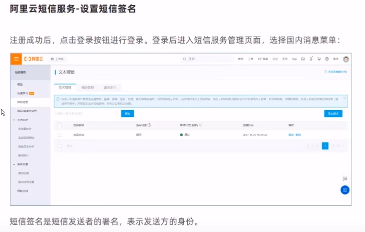

## 1. 说明

通过前面项目的开发，已经积累了一些开发经验，通过项目实战来检验学生的学习效果，同时激发学生的自学能力和自主解决问题的能力。原则上，所有实战内容需要学生独立完成。


剩余功能完成参考：https://blog.csdn.net/weixin_53142722/article/details/124371940


## 2. 需求

- [ ] **后台系统**
        
        	菜品管理（批量删除、起售停售）
        ​	套餐管理（修改、起售停售）
        ​	订单明细
    
- [ ] **移动端**
        
        	个人中心（退出登录、最新订单查询、历史订单、地址管理-修改地址、地址管理-删除地址）
        
        ​	购物车（删除购物车中的商品)

## 3. 开发环境搭建


### 3.1 创建数据库


（1）创建idea环境，导入pom文件，导入application.yml配置文件，放入前端资源，（配置WebMvc放行）

（2）创建mapper service controller 等包，创建相应的类或接口

（3）创建通用返回结果实体类R.java，放在common包下，R是一个通用结果类，服务端响应的所有结果最终都会包装成此种类型返回给前端。


## 【1】管理员后台功能

【1】系统登录/退出 功能

需求分析、代码开发、功能测试

（1）登录功能


（2）退出功能


（3）拦截器，防止跳过登录访问管理页面


## 【2】员工管理业务开发

（1）新增员工


controller层代码、全局异常处理


（2）员工信息分页查询


（3）启用/禁用员工信息


修复精度问题


（4）编辑员工信息


## 【3】分类业务管理

（1）公共字段填充


代码完善


（2）新增分类

创建Category相关接口、方法


（3）分类信息分页查询


（4）删除分类


CategoryService中实现自定义删除方法

```java
@Service
public class CategoryServiceImpl extends ServiceImpl<CategoryMapper, Category> implements CategoryService{
    @Autowired
    DishService dishService;
    @Autowired
    SetmealService setmealService;

    @Override
    public void remove(Long id) {
        //查询是否关联菜品
        LambdaQueryWrapper<Dish> dishLambdaQueryWrapper = new LambdaQueryWrapper<>();
        dishLambdaQueryWrapper.eq(Dish::getCategoryId, id);
        int count1 = dishService.count(dishLambdaQueryWrapper);
        if(count1 > 0){
            throw new CustomException("存在关联菜品，无法删除！");
        }

        //查询是否关联套餐
        LambdaQueryWrapper<Setmeal> setmealLambdaQueryWrapper = new LambdaQueryWrapper<>();
        setmealLambdaQueryWrapper.eq(Setmeal::getCategoryId, id);
        int count2 = setmealService.count(setmealLambdaQueryWrapper);
        if(count2 > 0){
            throw new CustomException("存在关联套餐，无法删除！");
        }
        //正常删除
        super.removeById(id);
    }
}
```

实现自定义异常类 

```java
package com.example.common;

public class CustomException extends RuntimeException{
    public CustomException(String msg){
        super(msg);
    }
}

```

将该异常捕获

```java
@ExceptionHandler(CustomException.class)
    public R<String> exceptionHandler(CustomException ex){
        log.error(ex.getMessage());

        return R.error(ex.getMessage());
    }
```


（5）修改分类


## 【4】菜品业务管理

（1）文件上传


服务端接受


（2）新增菜品


DTO

​	数据传输对象，用于展示层与服务层之间的数据传输。封装页面提交的数据。


（3）菜品信息分页查询

为了在前端显示出分类，需要利用DishDto


（4）修改菜品


## 【5】套餐业务管理

（1）新增套餐


（2）套餐信息分页查询


（3）删除套餐


## 【6】手机验证码登录

（1）短信发送





（2）手机验证码登录


 
